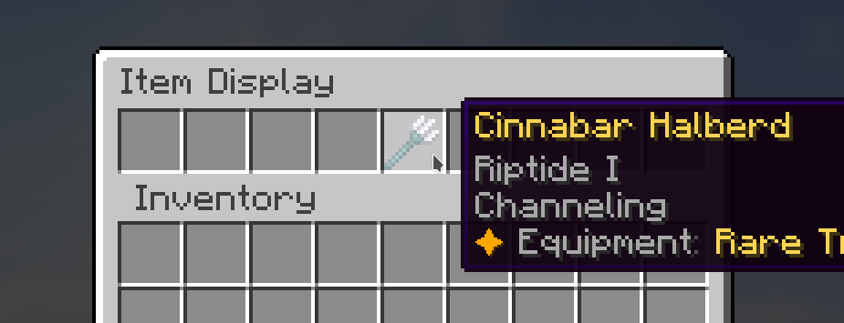

# ShowMyHand

ShowMyHand is a simple plugin that allows your players to share item previews with each other via chat.

Players can click the chat preview to see the item in a virtual display:

### Commands

`/showoff` - Sends a preview of the item in your hands to the server chat
`/showoff <player>` - Sends a preview of the item in your hands to another player

**Aliases** - `/showmyhand` `/hand` `/share`

### Installation
Simply drag the .jar file into your plugins folder

### Permissions
There is only one permission: `showmyhand.showoff` - this allows a player to use the /hand command. By default it is set to true for all players.

### Config
There is no configuration for this plugin.

### Support and Suggestions
If you have a suggestion for how to improve this plugin, or an issue while using it, please join the support discord https://discord.gg/yJthQdW5Ja